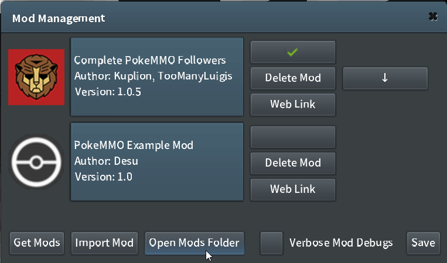
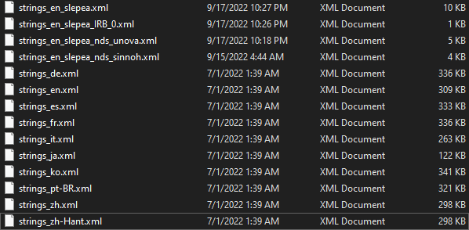

# Pokemmo strings_en_slepea Language

Has Gilan's Encounter Counter support! [GEC support](#gilans-encounter-counter)

## Install

**Download** [strings_en_slepea CURRENT RELEASE](https://github.com/LostPast/Pokemmo_strings_en_slepea/archive/refs/heads/strings_en_slepea.zip)

[strings_en](https://github.com/LostPast/Pokemmo_strings_en_slepea/archive/refs/heads/strings_en_default_2022_09-18.zip) If you have previously messed with this file. (version obtained 2022-09-18)

**Unzip** the Files for use!

- [PC](#PC)
- [Mobile](#Mobile)
- [Features](#Features)

### PC

1. Go to PokeMMO/data/strings. (C:\Program Files\PokeMMO\data\strings)
    - This can also be found through opening up PokeMMO
    - Clicking on
    
    

    - Clicking on Open Mods Folder
    
    

    - Then using the File Explorer to move from the **mods** folder to the **data** and then to the **strings** folder
2. Move the downloaded strings files from the **current release** to the **strings** folder
    - It should look like this
    
    

    - Any extra Files or Folders could break the string's compatability with GEC!
3. Set **Language** to **English - Slepea** in PokeMMO **Settings**
    - Might have to relaunch the game for changes to take effect.

### Gilan's Encounter Counter
- [Gilan's Encouter Counter](https://forums.pokemmo.com/index.php?/topic/137452-tool-gilans-encounter-counter-beta-available-v102-update/) is a [PC](#PC) only python program that counts the number of pokemon you have seen
- It is not required and up to you if you want to download it
- **English - Slepea** strings work with **GEC**

### Mobile

1. Go to where you input your ROMS
    - Click on Clear Imported Strings to set your strings to default

    

    - Click on Import Strings File
    - Select Downloaded Strings file
    - **Repeat** for every strings file downloaded from **current release**
2. Set **Language** to **English - Slepea** in PokeMMO **Settings**

### Features

- **Wont be overwritten** by Pokemmo updates
- Works with **Gilan's Encounter Counter** (only Gilian's has been made to work)
- Removes/Blanks/Shrinks strings used for;
    1. **Gym ReRuns**
    2. **Trainer ReBattles**
    3. **Berry Farming**
    4. **Pokemon Centers**
    5. **Overworld HMs**
    6. **Breeding**
    7. **Region Change Ferry**
    8. **& More Tweeks**